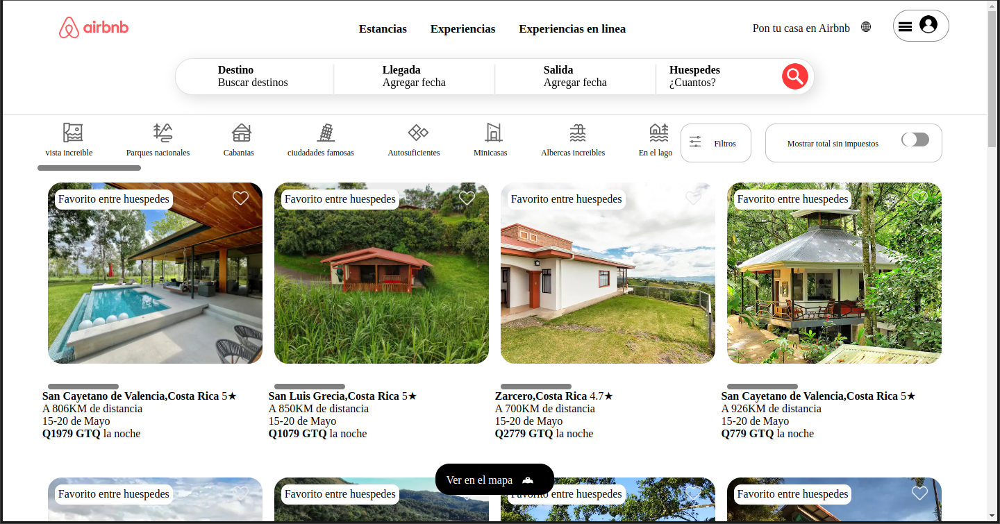

# Prueba

Esto es un proyecto hecho con HTML y CSS, implementando flex box. y varios temas basicos.
la duracion del proyecto fue de 3 dias.
Tratando sobre todo la fidelidad a los detalles con la pagina de Airbnb.

